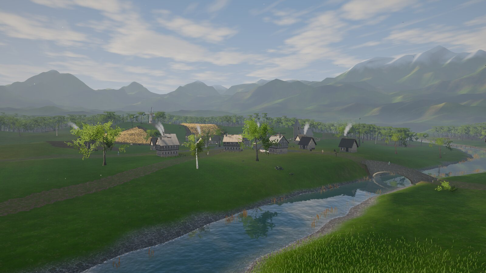
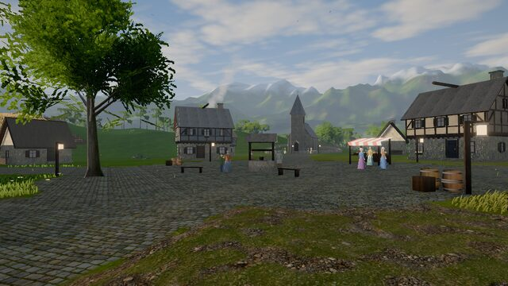
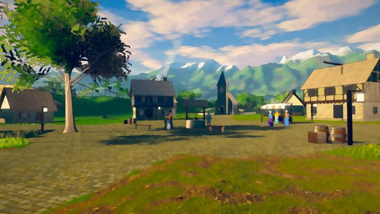
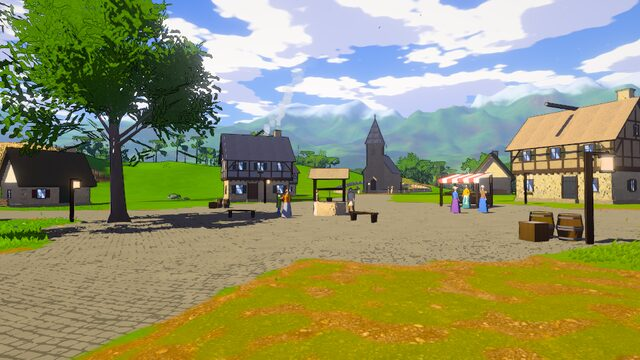
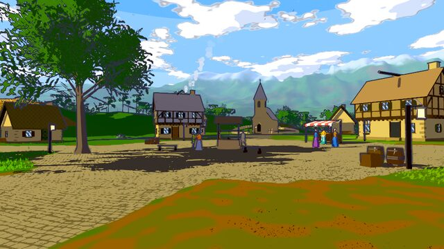
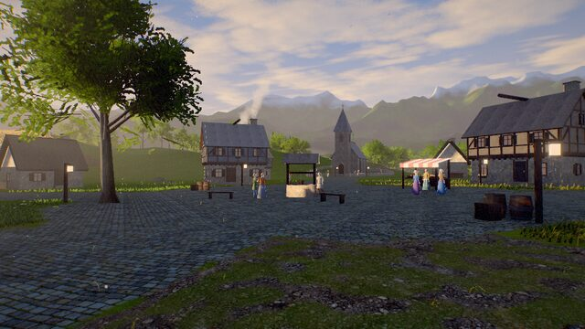

# Hollowmere

**A small handcrafted valley rendered in real time in the browser — with five switchable visual styles.**

**Live:** https://kubok758.github.io/Bench/



A river winds through a valley ringed by mountains. An old village of stone and half-timbered houses sits on a
rise above a stone bridge; a windmill turns on the hill to the west, a chapel bell tower stands to the north.
Paths lead out through wheat fields and meadows into dense mixed forest, to a clearing with an old oak, a
ring of standing stones, a mill pond with a dock and a rowing boat. Villagers walk the lanes, chat by the
well and tend the market stall; smoke drifts from chimneys, birds circle overhead, grass and trees move in
travelling gusts of wind.

## Controls

| Input | Action |
| --- | --- |
| **Click / Enter the valley** | leave the cinematic flyover and start exploring |
| **W A S D** / arrows | walk (Shift to run, Space to jump) |
| **Mouse** | look (click to capture the pointer, Esc to release; drag works too) |
| **F** | toggle free-fly camera (Space / E up, Q / Ctrl down, Shift fast) |
| **C** | toggle the cinematic tour |
| **1 – 5** | switch visual style |
| **H** | hide / show the little UI there is |
| touch | drag to look, press and hold to walk |

## The five styles

All five render the same world, same geometry and the same simulation. A style switch only changes shared
shader uniforms and post-processing parameters — nothing is recompiled at runtime. Each style also has its own
light design (time of day, key/fill balance, shadow colour), the way an art director would light the same set.

| 1 Natural | 2 Painterly | 3 Anime | 4 Cartoon | 5 Ultra |
| --- | --- | --- | --- | --- |
|  |  |  |  |  |

| Key | Style | What changes |
| --- | --- | --- |
| **1** | **Natural** | Physically based shading, clear afternoon sun, soft cascaded shadows, SSAO, aerial perspective, planar water reflections, AgX tone mapping. |
| **2** | **Painterly** | Arcane-inspired: lifted, half-banded light with cool teal shadows and a warm key light, painted terminator accents, warm rim light, 8-sector Kuwahara oil-paint filter, short directional brush strokes, wobbling ink lines, canvas grain, light shafts, filmic grade. |
| **3** | **Anime** | High noon cel shading with tinted shadows, crisp two-tone clouds, anime eyes on the villagers, colour-matched line art, soft "light diffusion" bloom, simplified flat textures, chunkier grass. |
| **4** | **Cartoon** | Flat colour with soft value-only posterisation and grey-protected saturation, hard two-tone light, thick black ink outlines, inked cartoon clouds, drawn cobblestones, halftone in the deepest shadows, stylised water. |
| **5** | **Ultra** | Sunset: low sun, ray-marched volumetric light through the shadow maps (shafts through foliage and haze around the sun), drifting fog banks, 4096² shadow cascade with 16-tap soft filtering, full-resolution AO, higher grass density and tree LOD distances, full-resolution reflections, caustics, cirrus layer, god rays, filmic grade, grain and lens touches. |

## What is in the world

* **Terrain** — a 1 km² hand-authored height field (river valley, village plateau, mill hill, standing-stones hill,
  meadow bowl) inside a 13 km ring of mountain ranges built from authored ridge lines. Ground material blends seven
  CC0 photo-scanned layers by masks (paths, cobbles, forest floor, meadow, rock, river pebbles) with
  two-sample anti-tiling, macro colour variation, cart ruts, wet banks and snow on the high peaks.
* **Water** — a river and mill pond with flow-mapped normals that follow the river, depth-based absorption,
  shore foam, sun glints and planar reflections; reeds, lily pads and a moored boat.
* **Vegetation** — procedurally grown oaks, birches, spruces and bushes with leaf-cluster atlases painted from real
  leaf scans, three LODs (full, simplified, baked impostor billboards), layered wind (trunk bend, branch sway,
  leaf flutter, travelling gusts), translucency; about 13 000 trees and 700 bushes; 300 k grass blades (450 k in Ultra) in three camera-following
  fields, 26 k wild flowers, ferns, 36 k wheat stalks, rocks, fallen logs, stumps and mushrooms.
* **Village** — fifteen stone and half-timbered houses (jettied upper floors, framing and braces, thatch or slate
  roofs, chimneys, shuttered windows with flower boxes), a chapel with a bell tower and churchyard, a windmill with
  turning sails, a well, a market stall, fences, carts, hay bales, laundry lines, lanterns; a stone arch bridge
  and a timber footbridge.
* **Life** — 21 villagers built procedurally (skinned meshes, clothing, hair, beards, faces), 14 of them walking a
  connected path graph between places in the village and out to the meadows with a procedural, skirt-aware walk
  cycle, the rest chatting by the well or tending the stall; flocks of birds, chimney smoke,
  butterflies, sunlit pollen motes, falling leaves.

## Running locally

```bash
npm install
npm run dev      # http://localhost:5173
npm run build    # production bundle in dist/
```

## Verification (Unlazy gates)

The build was driven by an [Unlazy](https://github.com/Leonxlnx/unlazy) ledger: [`GATES.md`](GATES.md) lists the
acceptance gates and [`PLAN.md`](PLAN.md) the decomposition and status log. Runnable gates are checked by
`tools/verify.mjs` (headless Chromium):

```bash
node tools/verify.mjs smoke      # boots with zero console errors and renders
node tools/verify.mjs modes      # keys 1-5 select five structurally different styles (tint-invariant metric)
node tools/verify.mjs content    # measured inventory: forest, meadows, houses, bridges, water, mountains, villagers…
node tools/verify.mjs life       # villagers walk, limbs animate, windmill turns, birds fly
node tools/verify.mjs controls   # smooth acceleration, eye height, mouse look, collisions, fly mode
node tools/verify.mjs perf       # draw-call / triangle budgets per style, CPU update time, adaptive resolution
node tools/verify.mjs ui         # minimal visible UI while exploring
```

Last run on the final build (headless Chromium with SwiftShader; smoke and modes also against the live Pages URL):

| Check | Measured |
| --- | --- |
| smoke | 15 frames rendered, 0 console errors, 0 requests outside the site — locally and on GitHub Pages |
| modes | smallest structural difference between any two styles 0.259 (threshold 0.25; a pure colour tint scores 0.005) |
| content | 13 286 trees + 733 bushes; forest 56.5 % / open meadow 33.3 % of the valley; 15 houses, chapel, windmill, 2 bridges; 2.09 km of paths; mountains up to 609 m; 21 villagers; 24 birds |
| life | 13 of 14 walkers moved with animated limbs within 5 s; windmill sails, birds and wind advance |
| controls | 5.8 m walked in 2 s, eye height 1.67 m, stops at the chapel and churchyard walls, fly mode climbs 17.7 m |
| perf | at most 269 draw calls and 8.8 M triangles in any style at the reference views; frame logic 0.2–0.3 ms median in the village. Real-GPU frame rates cannot be measured in this headless environment. |

## Performance notes

Built for desktop GPUs. Instanced everything, tree impostors beyond ~175 m, camera-centred grass fields with
distance thinning, a far shadow cascade refreshed every third frame, half-resolution reflections and AO outside
Ultra mode, and dynamic resolution scaling that steps the render scale down when frames run long and back up when
there is headroom.

## Credits

* Textures: [Poly Haven](https://polyhaven.com) (CC0) and leaf scans from [ambientCG](https://ambientcg.com) (CC0).
* Fonts: Cormorant Garamond and Inter (SIL Open Font License), self-hosted.
* Built with [three.js](https://threejs.org), [postprocessing](https://github.com/pmndrs/postprocessing) and
  [N8AO](https://github.com/N8python/n8ao).
